<div id="top">
<h1 align="center">Recipen</h1>

<div align="center">
  <br>
  
  
    
    
    
    
    
    
    
  </div>
  <br>

<h3>📝 Description :</h3>
Welcome to Recipen – a recipe website for food enthusiasts to explore, create, and share their culinary experiences. Indulge in a community-driven platform where food enthusiasts share their cherished recipes and captivating food blogs. Subscribe to the pro version to share your own recipes and to unlock a realm of taste, culture, and creativity.

<div align="center">
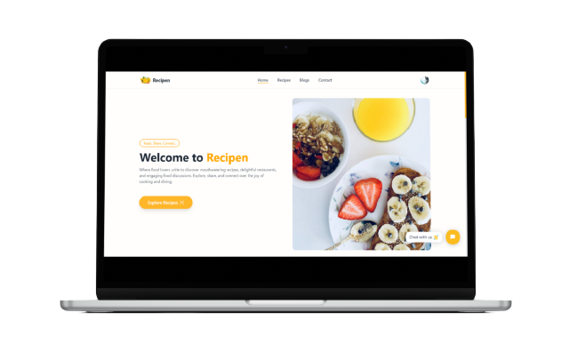
</div>

<br>

---

### 🌐 Link:

<h4> Live Site: https://recipen.vercel.app/ </h4>

<br>

### 🛠️ Tools and technologies used :

<div align=center>

<a href="https://www.w3.org/html/" target="_blank" rel="noreferrer">  </a>
<a href="https://www.w3schools.com/css/" target="_blank" rel="noreferrer">  </a>
<a href="https://developer.mozilla.org/en-US/docs/Web/JavaScript" target="_blank" rel="noreferrer">  </a>
<a href="https://reactjs.org/" target="_blank" rel="noreferrer">  </a>
<a href="https://nodejs.org" target="_blank" rel="noreferrer">  </a>
<a href="https://expressjs.com" target="_blank" rel="noreferrer">  </a>
<a href="https://www.mongodb.com/" target="_blank" rel="noreferrer">  </a>
<a href="https://redux-toolkit.js.org/" target="_blank" rel="noreferrer">  </a>
<a href="https://tailwindcss.com/" target="_blank" rel="noreferrer">  </a>
<a href="https://mui.com/" target="_blank" rel="noreferrer">  </a>
<a href="https://stripe.com/" target="_blank" rel="noreferrer">  </a>

</div>

<br>

### 👋 Connect with me:

<div align=center>

[](https://www.linkedin.com/in/dunna-avinash)
[](https://github.com/Avinash905)
<a href="mailto:avinash.90527@gmail.com" target="_blank"></a>
[](https://twitter.com/avinashdunna)

</div>

<br>

---

### ✨Features :

<ul>
    <li><strong>Authentication:</strong> Users can securely create accounts and log in to access personalized features and content.</li>
    <li><strong>Access & Refresh Token:</strong> Implemented access and refresh token mechanism for enhanced security during user authentication.</li>
    <li><strong>Authentication State Persistence:</strong> User authentication state is now persisted across sessions, providing a seamless user experience.</li>
    <li><strong>Storing Tokens in Cookies:</strong> Tokens are stored in secure cookies for better protection against cross-site scripting (XSS) attacks.</li>
    <li><strong>Recipes:</strong> Explore a rich collection of authentic recipes contributed by the community, covering a wide range of cuisines and tastes.</li>
    <li><strong>Food Blogs:</strong> Engage with insightful and creative food blogs written by enthusiasts, offering valuable insights and cooking inspiration.</li>
    <li><strong>Stripe Payment Integration:</strong> Seamlessly integrated Stripe for secure payment processing, enhancing user experience during transactions.</li>
    <li><strong>One-Time Payment Subscription:</strong> Offer users the option to subscribe with a one-time payment, unlocking exclusive features and benefits.</li>
    <li><strong>Pro User Access:</strong> Pro users enjoy the privilege of adding and deleting recipes and blogs, creating a dynamic and engaging platform.</li>
    <li><strong>Admin Dashboard:</strong> Admins have access to a dashboard for managing users, recipes, and blogs</li>
    <li><strong>User Profile:</strong> Each user has a personalized profile where they can manage their information.</li>
    <li><strong>Contact Us Page:</strong> A dedicated page for users to reach out with questions, concerns, or feedback, fostering communication.</li>
    <li><strong>Chatbot:</strong> A chatbot that provides one to one assistance with the maintainers of the project.</li>
    <li><strong>Save and Unsave Favorite Recipes:</strong> Users can curate their own collection of favorite recipes for easy access and cooking inspiration.</li>
    <li><strong>Rate and Comment on Recipes:</strong> Registered users can provide ratings and comments on recipes, enhancing the community interaction.</li>
    <li><strong>Comment on Blogs:</strong> Engage in discussions by leaving comments on the food blogs, sharing thoughts and ideas.</li>
    <li><strong>Share Recipe on Social Media:</strong> Users can effortlessly share their favorite recipes on various social media platforms.</li>
</ul>

<hr/>

<p align="right"><a href="#top">Back to Top</a></p>

### Steps to run the project on your local machine

<ol>
<li>Fork this repository</li>
<li>Open terminal or command prompt on your local machine. Run the following command to clone the repository:</li>

```
git clone https://github.com/your-username/your-repo.git
```

Replace **your-username** with your GitHub username and **your-repo** with the name of your repository.

<li>Open the project and rename <strong>.env.example</strong> files to <strong>.env</strong> in both client and server directory.</li>

<li>Add your own environment variables to these both files.</li>

<li>Add <strong>http://localhost:5173</strong> and <strong>http://localhost:5000</strong> to <strong>allowedOrigins</strong> array present in the path <strong>server/config/allowedOrigins.</strong></li>

<li>To run the frontend, open a new terminal and run 'cd client/' to go to client directory and execute:</li>

```
npm run dev
```

<li>To run the backend, open a new terminal and run 'cd server/' to go to server directory and execute:</li>

```
nodemon index.js
```

<li>Open <strong>http://localhost:5173/</strong>strong> from your browser to run the webapp.</li>
</ol>

<br>

### Steps to access the admin dashboard

<ol>
<li>After running the webapp on your machine sign up on the website.</li> 
<li>Now open your MongoDB collection and manually add the <strong>Admin</strong> element in the array of <strong>roles</strong> field for the user you want to make admin and then Sign in back on the site.</li>
<li>Now you will be able to access the admin dashboard.</li>
</ol>

<hr/>

<p align="right"><a href="#top">Back to Top</a></p>

### Home page

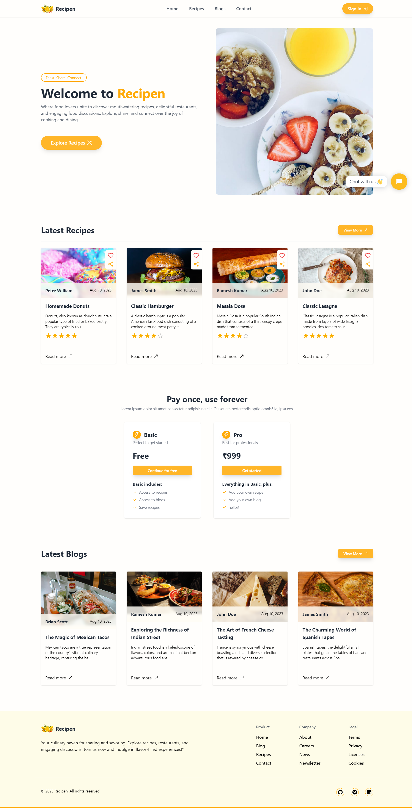

### Sign up page

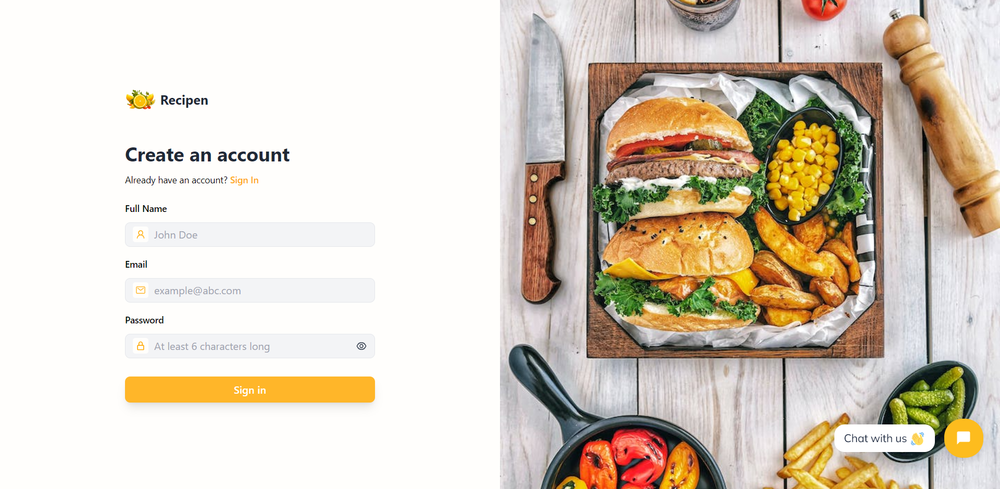

### Sign in page

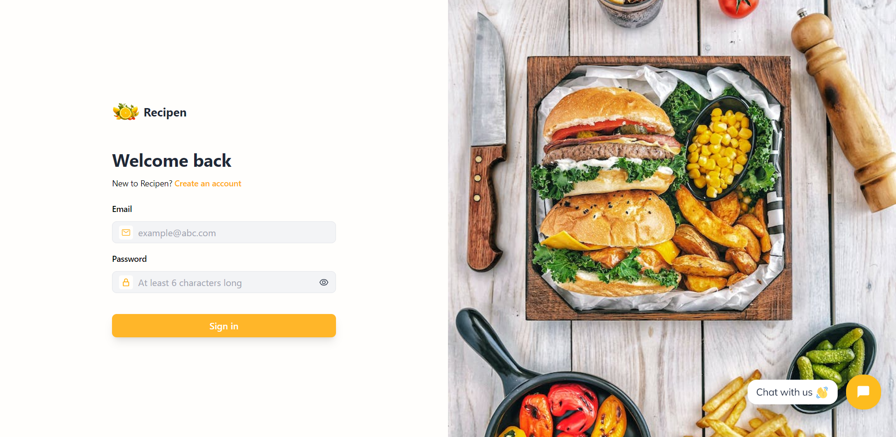

### Profile page

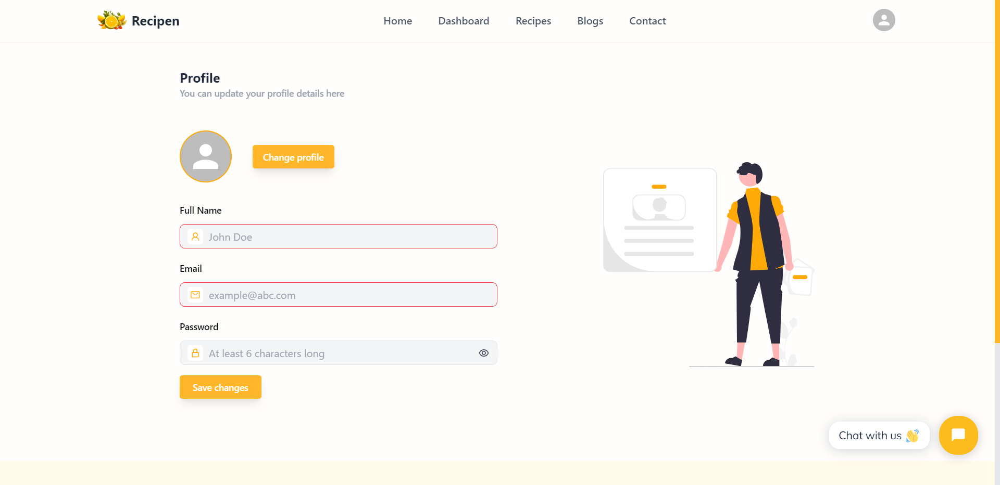

### Contact page

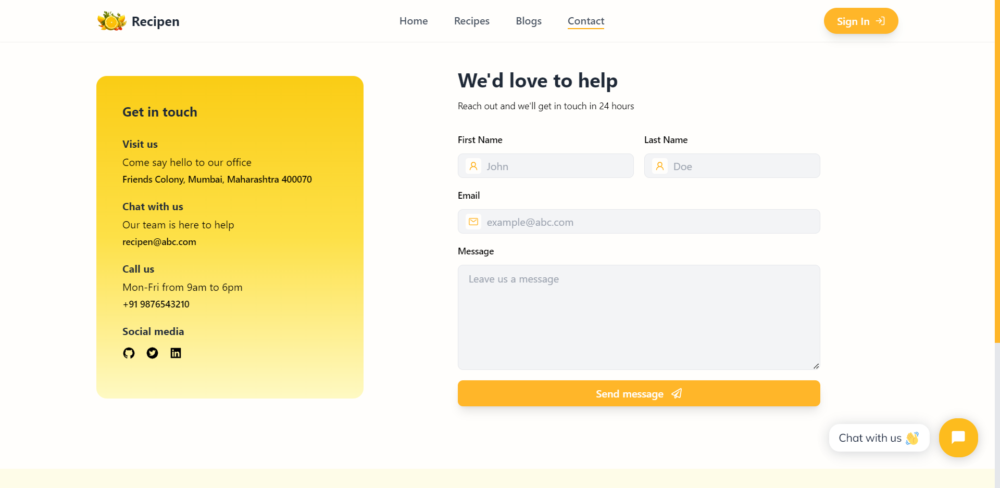

### Recipes page

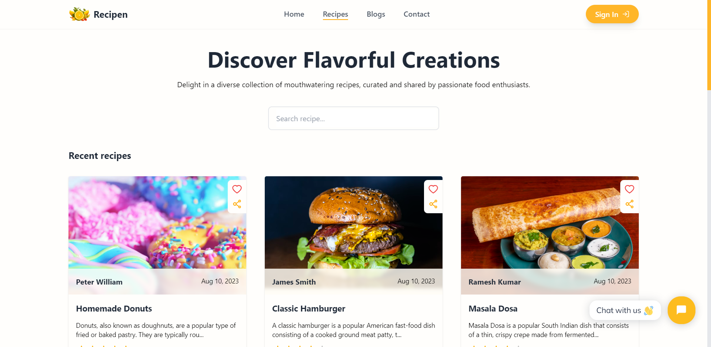

### Blogs page

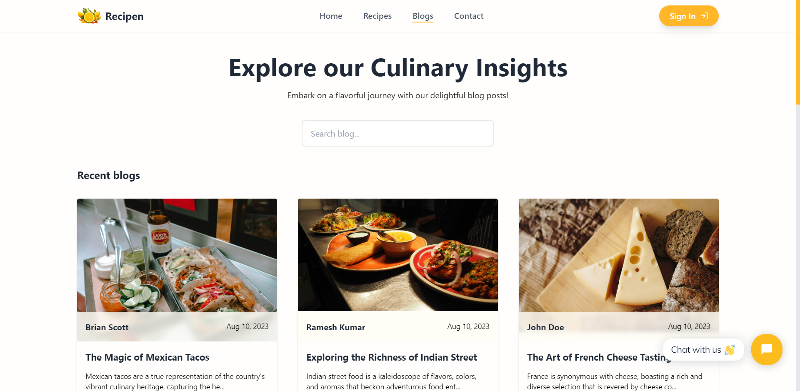

### Single recipe page

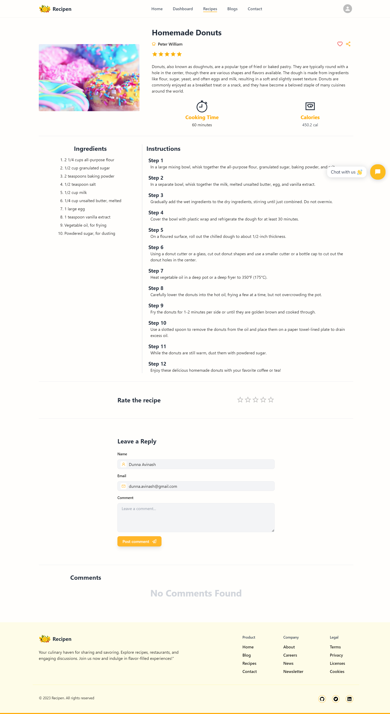

### Single blog page

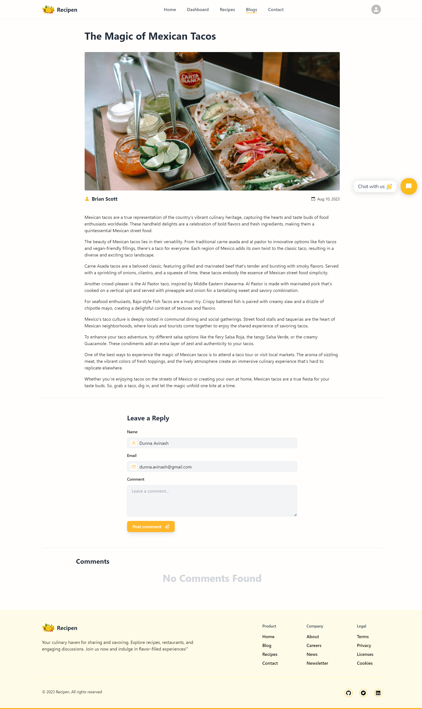

### Add recipe page

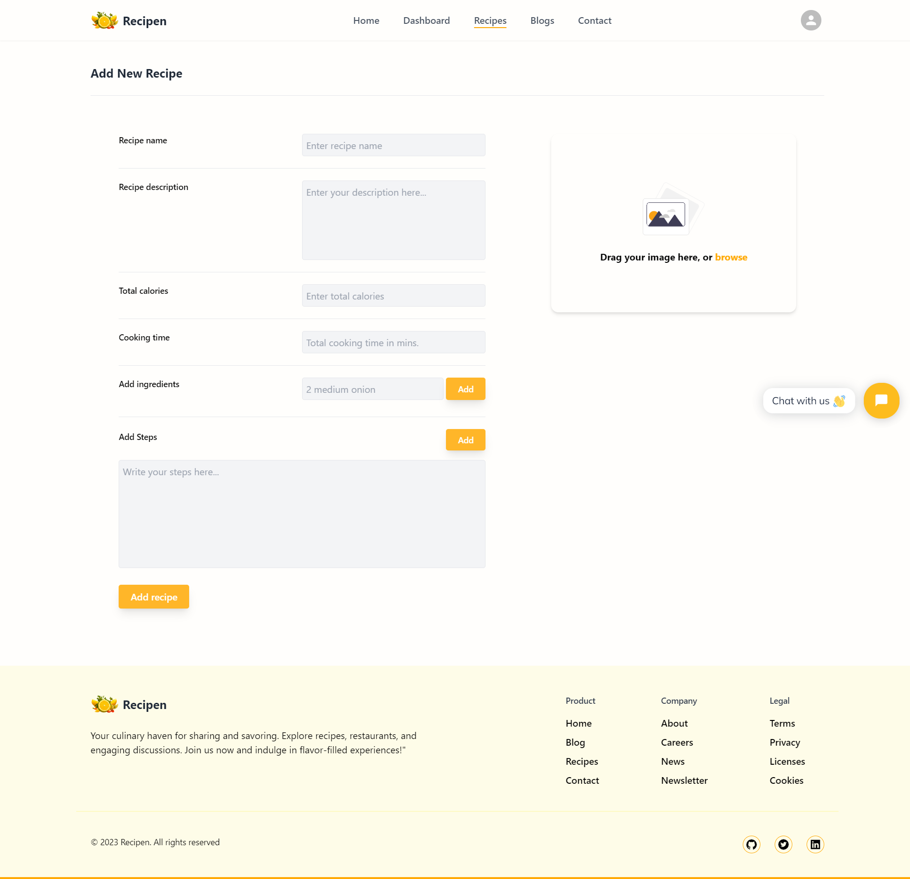

### Add blog page

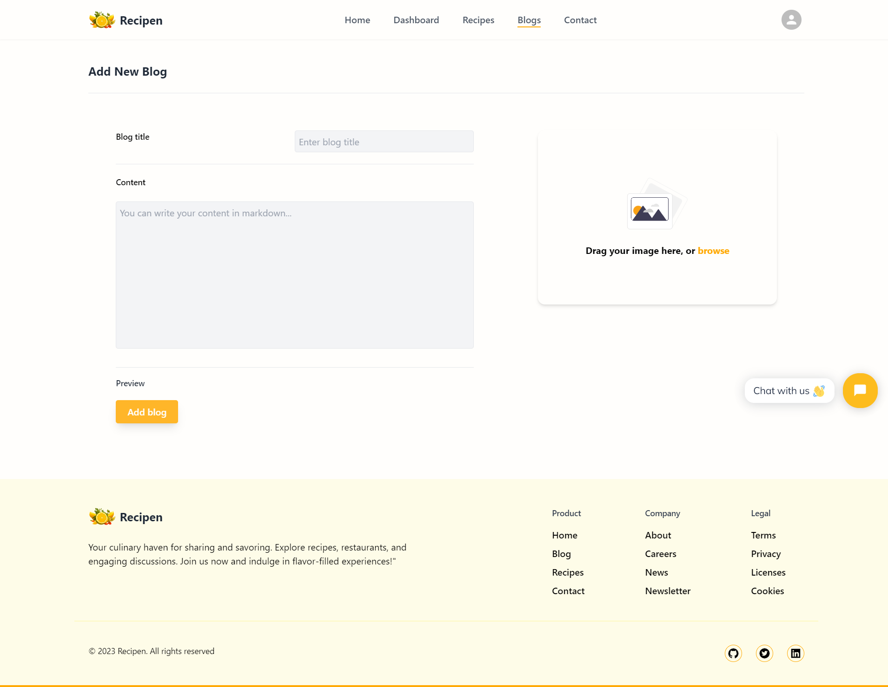

### Admin users dashboard

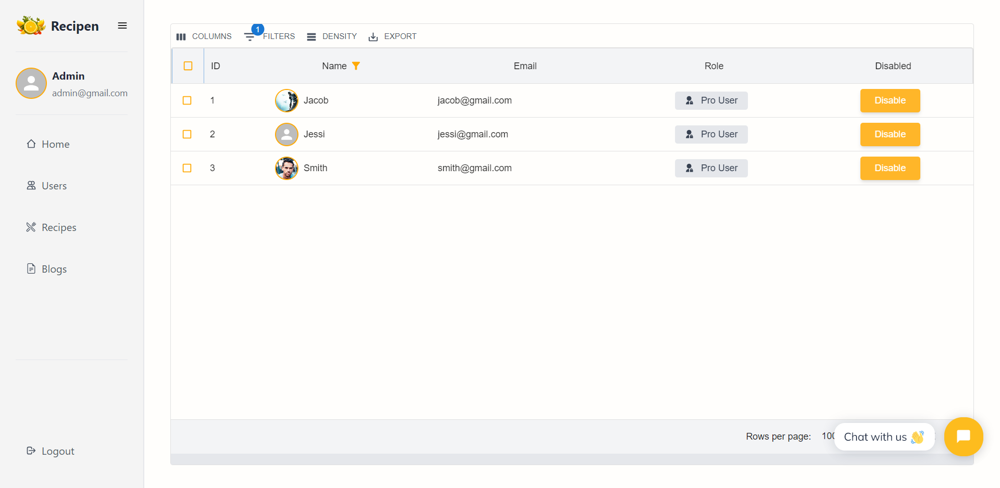

### Admin recipes dashboard

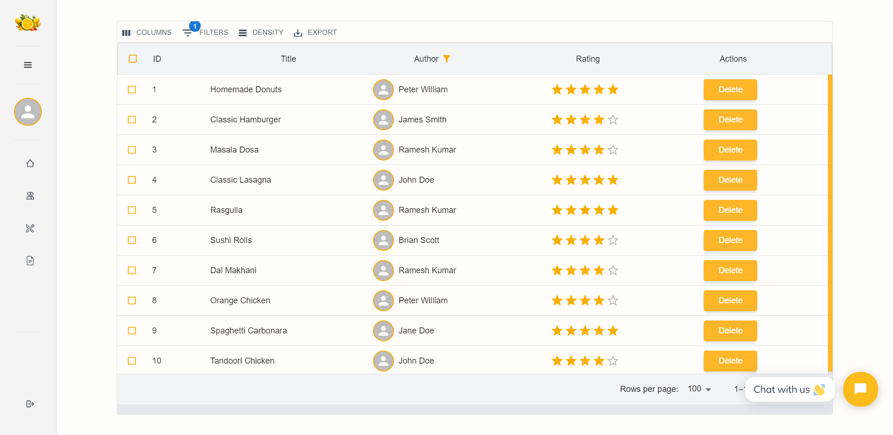

### Admin blogs dashboard

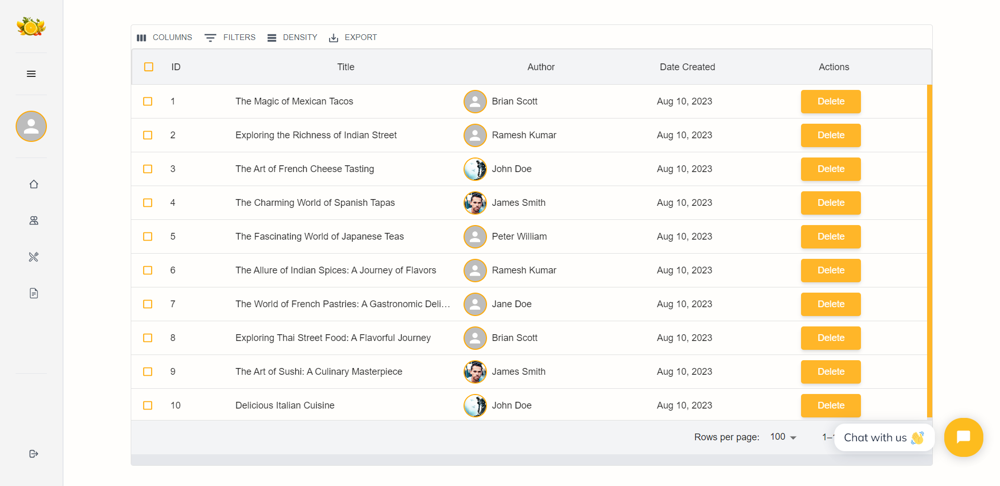

<hr/>

### 🛡️ License

[](https://opensource.org/licenses/MIT)

Terms and conditions for use, reproduction and distribution are under the [MIT License](https://opensource.org/license/mit/).

<br/>

---

<h3 align="center"> Give it a 🌟 if you 🧡 this repository </h3>

---

<p align="right"><a href="#top">Back to Top</a></p>

</div>
